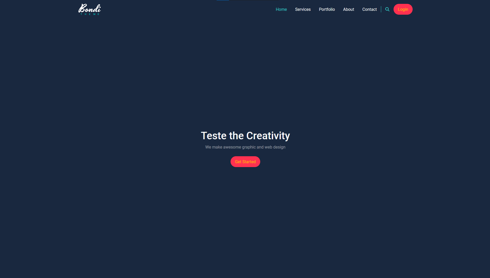

> Bondi

<!-- ABOUT THE PROJECT -->

## About The Project



This repository contains a simple web page built using HTML and CSS and Bootstrap. The project serves as a foundational example of web development, showcasing clean and minimalistic design principles

## Usage

1. Clone the repository:

```sh
  git clone git@github.com:AhmedMstafa/Bondi.git
```

2. Navigate to the project directory:

```sh
  cd Bondi
```

3. Open `index.html` in your web browser to view the page.

### Visit out the live version of the website [here](https://bondi-phi.vercel.app/)
